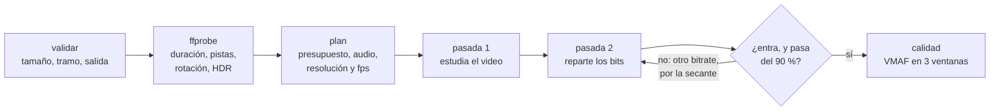

# vidsquash

<p>
  
  
  
  
  <a href="LICENSE"></a>
</p>

Comprimí un video para que entre en un tamaño: los 10 MB de Discord, los 16 de WhatsApp, los 25 de un mail. vidsquash no te pide un bitrate ni una calidad: le decís a qué tamaño tiene que llegar y decide el resto (resolución, cuadros por segundo, audio, cuántos bits a cada cosa) para que se vea lo mejor posible y nunca se pase.

```powershell
vidsquash partida.mp4 --for discord                    # 10 MB
vidsquash viaje.mov -s 16MB                            # para WhatsApp
vidsquash charla.mp4 -s 25MB --from 2:10 --to 5:40     # solo un tramo
vidsquash juego.mp4 -s 50MB --keep-fps -p slow         # conservar los 60 fps y exprimir calidad
```

> [!WARNING]
> **0.1.0, en construcción: todavía no se probó de punta a punta con videos reales.** Compila, la interfaz está completa, el planificador tiene sus pruebas y la CI comprueba cada validación del `.exe`, pero nunca codificó un video de verdad: ni un clip sintético, ni uno de celular vertical, ni un HDR de iPhone. Tomalo como una versión para probar, no para confiarle el único original de un video. El plan de esa prueba, y lo que hay que mirar en ella, está en [docs/PENDIENTE.md](docs/PENDIENTE.md). Hasta que pase no hay release ni demo.

Un único `.exe` en Go puro que usa [ffmpeg](https://ffmpeg.org) para codificar: sin instalador, sin nube; el video no sale de la máquina. Antes vivía en navaja, una suite de herramientas de consola para Windows, con el motor escrito y sin ejecutable; como proyecto propio arranca en la 0.1.0, con su punto de entrada.

[Estado](#estado) · [Por qué](#por-qué) · [Instalar](#instalar) · [Uso](#uso) · [Cómo funciona](#cómo-funciona) · [Cómo se verificó](#cómo-se-verificó) · [Lo que falta](#lo-que-falta)

## Estado

| | |
|---|---|
| **Comprobado** | que compila y pasa `go vet` (también para Linux); **57 pruebas de Go**, 7 del planificador; la ayuda, la versión y cada validación de la línea de comandos del `.exe`, con su mensaje y su código de salida, en cada corrida de la CI; que encuentra ffmpeg donde lo deja `winget` |
| **Escrito, sin probar contra un video** | leer el video con ffprobe (rotación, HDR, audio), las dos pasadas con corrección del tamaño, la conversión HDR → SDR, la medición de calidad con VMAF |
| **Diseñado, sin escribir** | `--analyze`: elegir resolución y fps midiendo muestras en vez de estimar |

## Por qué

Achicar un video para mandarlo es un problema de presupuesto, no de calidad: el límite está en megabytes. Las recetas de siempre piden un CRF o un bitrate y se prueba hasta que entra; con un bitrate fijo, el tamaño depende de la duración, y el mismo número que deja un clip de 30 segundos en 5 MB deja uno de 3 minutos en 30. Y hay decisiones que el número solo no toma:

- **A pocos bits, menos cuadros o menos resolución.** Con poco presupuesto, un 1080p60 suele verse peor que un 720p30: los bits por píxel no alcanzan.
- **El audio también cuenta**, y un mono limpio suena mejor que un estéreo estrujado.
- **Un video vertical de celular** no es uno de 1920 de alto: la escalera de resoluciones va por el lado corto.
- **Un video HDR de iPhone** se ve lavado en una pantalla común si no se convierte a SDR.
- **"Casi 10 MB" no entra en Discord.** El resultado tiene que quedar por debajo, siempre.

## Instalar

vidsquash usa **ffmpeg** para codificar:

```powershell
winget install Gyan.FFmpeg
```

Lo busca junto a `vidsquash.exe`, después en el `PATH` y después donde lo deja winget: en `WinGet\Links` o en el paquete de Gyan.FFmpeg de `WinGet\Packages`. Así lo encuentra también en una terminal abierta antes de instalarlo, que todavía no ve el `PATH` nuevo.

Con [Go](https://go.dev/dl) 1.26 o más nuevo (con un Go 1.21+ más viejo, Go baja solo la versión que pide el `go.mod`):

```powershell
go install github.com/agustinyarrus/vidsquash@latest
```

Desde el repo:

```powershell
.\build.ps1          # dist\vidsquash.exe, con la versión, el commit y el SHA256
.\build.ps1 -Test    # antes, go vet y todas las pruebas
```

No hay release todavía: la primera, la 1.0.0, sale cuando pase la prueba con videos reales. No tiene módulos externos de Go.

## Uso

| Flag | Qué hace |
|---|---|
| `-s`, `--size TAMAÑO` | el tamaño máximo del archivo final: `25MB`, `8M`, `1,5GB`, `500KiB` |
| `--for discord\|whatsapp\|outlook\|gmail` | el límite de un servicio: 10, 16, 20 o 25 MB |
| `--from TIEMPO`, `--to TIEMPO` | solo un tramo (`90`, `1:30`, `1m30s`) |
| `-c`, `--codec h264\|h265` | h264 se reproduce en todos lados; h265 ocupa ~30 % menos pero no todos lo abren (h264) |
| `-p`, `--preset veryfast…slower` | el esfuerzo del codificador: más lento, mejor calidad al mismo tamaño (medium) |
| `--max-res N` | tope del lado corto (720 = como mucho 720p) |
| `--keep-fps` | no bajar los cuadros por segundo (juegos, deportes) |
| `--no-audio` | descartar el audio: todos los bits al video |
| `-o`, `--out ARCHIVO` | la salida (por defecto, `<nombre>-<tamaño>.mp4` al lado del original) |
| `-f`, `--force` | sobrescribir la salida si ya existe |
| `--no-quality` | no medir la calidad al final |

Los tamaños van en unidades decimales (1 MB = 1.000.000 bytes), como los anuncian los servicios; también se aceptan `MiB` y `GiB`, y la coma decimal. Flags al estilo GNU; un flag o un valor mal escrito sugiere el más parecido. Códigos de salida: `0` todo bien · `2` línea de comandos inválida · `3` no se pudo (el archivo no existe, falta el tamaño, no hay ffmpeg, el objetivo no alcanza) · `130` cancelado con Ctrl+C.

<details>
<summary><code>vidsquash --help</code>, entera</summary>

```text
> vidsquash --help

  vidsquash  ·  comprime un video para que entre en un tamaño                               v0.1.0

  uso
    vidsquash <video> -s <tamaño> [opciones]
    vidsquash clip.mp4 -s 25MB
    vidsquash clip.mp4 --for discord

  objetivo
    -s, --size TAMAÑO                tamaño máximo del archivo final: 25MB, 8M, 1,5GB, 500KiB
        --for discord|whatsapp|outlook|gmail
                                     límite de un servicio: discord 10 MB · whatsapp 16 MB ·
                                     outlook 20 MB · gmail 25 MB

  recorte
        --from TIEMPO                empezar en este punto (90, 1:30, 1m30s)
        --to TIEMPO                  terminar en este punto

  receta
    -c, --codec h264|h265            h264 se reproduce en todos lados; h265 ocupa ~30 % menos pero
                                     no todos lo abren (h264)
    -p, --preset veryfast|faster|fast|medium|slow|slower
                                     esfuerzo del codificador: más lento = mejor calidad al mismo
                                     tamaño (medium)
        --max-res N                  tope del lado corto (720 = como mucho 720p) (0)
        --keep-fps                   no bajar los cuadros por segundo (juegos, deportes)
        --no-audio                   descartar el audio (todos los bits al video)

  salida
    -o, --out ARCHIVO                archivo de salida (por defecto: <nombre>-<tamaño>.mp4 al lado
                                     del original)
    -f, --force                      sobrescribir la salida si ya existe
        --no-quality                 no medir la calidad al final (ahorra unos segundos)

  general
    -h, --help                       muestra esta ayuda
    -V, --version                    muestra la versión
        --no-color                   salida sin colores (también respeta NO_COLOR)

  ejemplos
    vidsquash partida.mp4 --for discord                que entre en los 10 MB de Discord
    vidsquash viaje.mov -s 16MB                        para WhatsApp; un video HDR de iPhone se
                                                       convierte a SDR
    vidsquash charla.mp4 -s 25MB --from 2:10 --to 5:40
                                                       solo un tramo, para mandarlo por mail
    vidsquash juego.mp4 -s 50MB --keep-fps -p slow     conservar los 60 fps y exprimir calidad

  notas
    · Los tamaños van en unidades decimales (1 MB = 1.000.000 bytes), como los anuncian los
      servicios.
    · Codifica en dos pasadas y, si el resultado se pasa del límite, corrige solo la segunda:
      nunca entrega un archivo más grande que el pedido.
    · Con pocos bits, primero baja los cuadros por segundo (60 → 30) y después la resolución: en
      contenido común se ve mejor.
    · Necesita ffmpeg (winget install Gyan.FFmpeg). Todo es local: el video no sale de la máquina.
```

</details>

Lo que ya se puede ver del `.exe` es la frontera: cada validación ocurre antes de buscar ffmpeg, así un error de uso no espera a que arranque nada. Salidas reales, en una consola de 100 columnas:

```text
> vidsquash partida.mp4 --for discrod

  ✗ --for: "discrod" no es una opción; ¿quisiste decir "discord"? (discord, whatsapp, outlook,
    gmail)
  › vidsquash --help muestra todas las opciones
```

```text
> vidsquash partida.mp4 -s 50KB

  ✗ 50,0 KB es demasiado poco para un video
```

```text
> vidsquash partida.mp4

  ✗ falta el tamaño objetivo: -s 25MB o --for discord
```

## Cómo funciona

> Esto describe cómo está escrito, no algo que ya se haya comprobado con videos reales.



### El plan

[`squash.MakePlan`](internal/squash/plan.go) es puro: recibe lo que dijo ffprobe y las opciones, y devuelve la receta o por qué no se puede, sin tocar el disco ni lanzar nada. Por eso es lo que tiene pruebas.

- **Presupuesto**: el objetivo menos un margen del 2 %, menos lo que ocupa el contenedor MP4 (4.096 bytes fijos, 12 por cuadro de video y 6 por cuadro de audio AAC). Lo que queda, dividido por la duración (la del tramo, si hay recorte), son los kb/s.
- **Audio**, por escalones (160, 128, 96, 64, 48 o 32 kb/s), nunca por encima del original, a estéreo como mucho y a mono por debajo de 64 kb/s.
- **Resolución y cuadros por segundo**, por bits por píxel: la primera combinación que alcanza 0,050 en H.264 (0,035 en H.265). La escalera de resoluciones va por el lado corto (2160, 1440, 1080, 720, 540, 480, 360, 240) y nunca agranda; a igual resolución se prueban primero los fps originales y después la mitad (si el original pasa de 30 y la mitad no baja de 24).
- **Imposibles**: por debajo de 45 kb/s de video ya no es video, es un mosaico. El plan devuelve un error con una sugerencia (recortar o pedir más), no un archivo que no sirve.

### Las pasadas

- **Dos pasadas**: la primera estudia el video entero y anota dónde hacen falta bits; la segunda reparte el presupuesto con esa información.
- **Corrección por la secante.** Si el resultado se pasa del objetivo o queda por debajo del 90 %, se repite solo la segunda pasada (las estadísticas de la primera sirven para cualquier bitrate). El próximo bitrate sale del método de la secante sobre tamaño(bitrate), que es monótona; apunta al 98,5 % del objetivo, la última corrección al 97 %, y son tres como mucho.
- **Nunca más grande que lo pedido**: se queda con el intento más grande que entra, y si ninguno entra es un error.
- **HDR → SDR** con la curva Hable, pasando por luz lineal (`zscale`); el contenedor con `+faststart`, para que el video arranque antes de bajarse entero, y la etiqueta `hvc1` en H.265, sin la que iPhone y Mac no lo reproducen.
- **Sin archivos a medias**: los intentos van a una carpeta de trabajo propia que se borra al final, y el mejor se mueve al destino. Un Ctrl+C corta ffmpeg y no deja nada en la carpeta del video.

### La calidad

VMAF, la métrica perceptual de Netflix (0 a 100), sobre tres ventanas de 2 s al 20, 50 y 80 % del video, contra el original llevado a la misma resolución y los mismos cuadros; si el ffmpeg instalado no trae libvmaf, SSIM. La tarjeta lo traduce a palabras ("indistinguible del original" desde 93, "muy buena" desde 85…).

Más detalle: [docs/ARQUITECTURA.md](docs/ARQUITECTURA.md).

## Cómo se verificó

- **57 pruebas de Go** (`go test ./...`). Las 7 del planificador comprueban, sobre videos descritos (sin ffmpeg), que el plan nunca promete más bytes que el objetivo, que los verticales se escalan por el lado corto, que nunca se agranda, que con pocos bits bajan primero los fps, que un objetivo imposible da un error con sugerencia y las reglas del audio. Otra comprueba que ffmpeg se encuentra en el paquete de winget.
- **La frontera del `.exe`** ([`frontera.ps1`](.github/frontera.ps1)), en cada corrida de la CI: la ayuda, la versión, un archivo que no existe, el tamaño que falta o no alcanza, `--to` antes de `--from`, un `--for` y un flag mal escritos y, sin ffmpeg a la vista, que lo diga. 9 de 9, cada uno con su mensaje y su código.
- **CI en `windows-latest`** con el Go mínimo del `go.mod` ([`ci.yml`](.github/workflows/ci.yml)): formato, `go vet` (también para Linux), todas las pruebas, el `.exe` con su versión y su SHA256, y la frontera.

Lo que falta es lo importante: codificar videos de verdad y comprobar con `ffprobe`, que es independiente de vidsquash, que el tamaño queda por debajo del objetivo y que la duración y las pistas se conservan. El detalle: [docs/VERIFICACION.md](docs/VERIFICACION.md).

## Lo que falta

1. **La prueba de punta a punta** con un clip sintético 1080p60, un video vertical de celular y un HDR de iPhone rotado, a 10, 16 y 25 MB y con un recorte. Lo que hay que mirar ahí, porque ninguna prueba lo cubre: que la rotación se aplique una sola vez, un video con carátula, uno con fps variable, el tone mapping con el ffmpeg de winget y que la corrección converja en uno o dos intentos. Con eso pasado, la 1.0.0 y su release.
2. `--analyze`: elegir resolución y fps midiendo muestras.
3. Menores: un tamaño que falta es un error de uso y hoy sale con código 3 (debería ser 2); un ffprobe falso para probar la lectura de rotación y HDR sin ffmpeg.

La lista, con cómo verificar cada punto: [docs/PENDIENTE.md](docs/PENDIENTE.md).

## Estructura

```
main.go               abre la consola y llama a vidsquash.Main
internal/
  vidsquash/          la herramienta: flags, presets, la receta, el progreso vivo y la tarjeta
  squash/             el planificador (puro), las dos pasadas con corrección y la calidad
  ffx/                encontrar y correr ffmpeg y ffprobe, leer el video y el progreso
  fsx/                escritura atómica, nombres para mostrar
  cli/                flags estilo GNU, tamaños y tiempos, ayuda, "¿quisiste decir…?"
  tui/                consola: paleta, región viva, tarjetas, formato es-AR
  textdist/           distancia de Damerau–Levenshtein
  win/desk/           modo y tamaño de la consola, por syscall
  version/            versión y commit, estampados por build.ps1
docs/                 arquitectura, verificación y lo que falta
.github/              la CI: formato, vet, pruebas, la frontera del .exe y su SHA256
build.ps1             compila dist\vidsquash.exe con la versión y el commit (-Test: antes, vet y pruebas)
```

## Licencia

[MIT](LICENSE).
